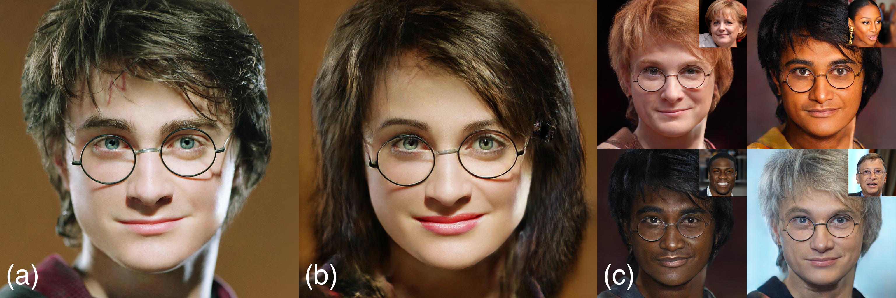
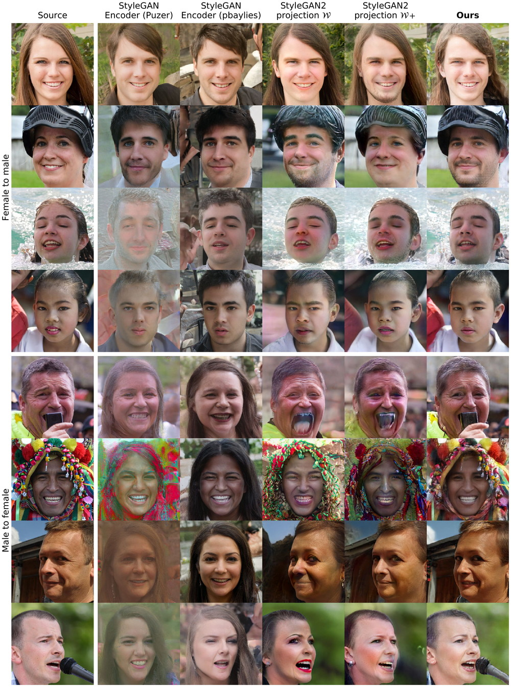
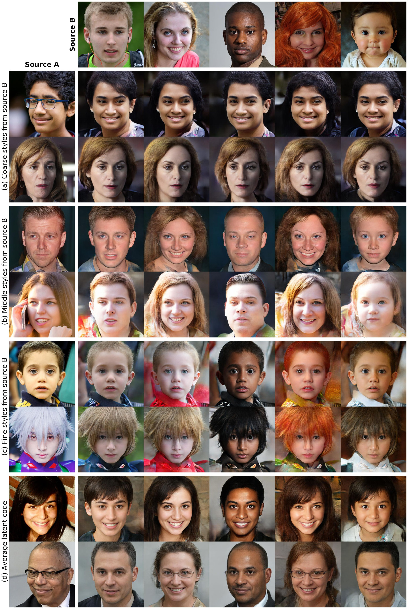

## StyleGAN2 Distillation for Feed-forward Image Manipulation


**Paper:** https://arxiv.org/abs/2003.03581

**TL;DR: Paired image-to-image translation, trained on synthetic data generated by StyleGAN2 outperforms existing approaches in image manipulation.**

> **StyleGAN2 Distillation for Feed-forward Image Manipulation**<br>
> Yuri Viazovetskyi<sup>*1</sup>, Vladimir Ivashkin<sup>*1,2</sup>, and Evgeny
 Kashin<sup>*1</sup> <br>
> [1]Yandex, [2]Moscow Institute of Physics and Technology (\* indicates equal
> contribution).<br>
> **Abstract:** *StyleGAN2 is a state-of-the-art network in generating
 realistic images. Besides, it was explicitly trained to have disentangled directions in latent space, which allows efficient image manipulation by varying latent factors. Editing existing images requires embedding a given image into the latent space of StyleGAN2. Latent code optimization via backpropagation is commonly used for qualitative embedding of real world images, although it is prohibitively slow for many applications. We propose a way to distill a particular image manipulation of StyleGAN2 into image-to-image network trained in paired way. The resulting pipeline is an alternative to existing GANs, trained on unpaired data. We provide results of human faces’ transformation: gender swap, aging/rejuvenation, style transfer and image morphing. We show that the quality of generation using our method is comparable to StyleGAN2 backpropagation and current state-of-the-art methods in these particular tasks.*

## Additional materials
- [**Uncurated generated examples**](https://drive.google.com/open?id=1RwMUjvYVz-1TGHjrhUn8512HsGWBSmEk)
- [**Synthetic dataset for gender swap**](https://drive.google.com/file/d/1gBgiWYPgm_NRrwWk8bMKdiFQ7FXTFi1s/view?usp=sharing)
- Pix2pixHD weights for [**to female translation**](https://drive.google.com/file/d/1frJERJr0WM_R38LnSFQ6XjGQtcXnLco1/view?usp=sharing) and for [**to male translation**](https://drive.google.com/file/d/1-6J1CYLsIysk38X9DNN23lIcnvOr8aYh/view?usp=sharing)

## Results
### Gender swap
<br>
[Full-size](https://drive.google.com/open?id=1hIdu9Mdefec8LpeAybfEGu5_Lnjbx1Qa)

### Aging
<br>
[Full-size](https://drive.google.com/open?id=1MmY8yZbu0K_CH3dX30Yz-jMkd8C9xIuo)

### Style mixing
<br>
[Full-size](https://drive.google.com/open?id=1bYNOXDUC84muncjtFY6visatyyICBTDE)

## Usage
Based on [stylegan2](https://github.com/NVlabs/stylegan2) and 
[pix2pixHD](https://github.com/NVIDIA/pix2pixHD) repos. To use it, you must
 install their requirements.
 
### Inference notebook
[](https://colab.research.google.com/github/EvgenyKashin/stylegan2-distillation/blob/master/Model_infer.ipynb)

### Search for directions
In stylegan2 directory.

- Generate random images and save source dlatents vectors:
```
python run_generator.py generate-images-custom --network=gdrive:networks/stylegan2-ffhq-config-f.pk
 --truncation-psi=0.7 --num 5000 --result-dir /mnt/generated_faces
```
- Predict attributes for each image with some pretrained classifier (we used internal)
- Use `Learn_direction_in_latent_space.ipynb` to find a direction in dlatents
- Alternatively, you can use publicly available vectors 
https://twitter.com/robertluxemburg/status/1207087801344372736 
(stylegan2directions folder in root)

### Creating paired dataset
- Generate the dataset using a vector:
```
python run_generator.py generate-images-custom --network=gdrive:networks/stylegan2-ffhq-config-f.pkl
 --truncation-psi=0.7 --num 50000 --result-dir /mnt/generated_ffhq_smile
 --direction_path ../stylegan2directions/smile.npy --coeff 1.5
```
- Our filtered gender 
[dataset](https://drive.google.com/file/d/1gBgiWYPgm_NRrwWk8bMKdiFQ7FXTFi1s/view?usp=sharing) 
as an example
- Use `Dataset_preprocessing.ipynb` to transform data in pix2pixHD format
 TODO: make a script

### Fitting transform
In pix2pixHD directory.

Training command:
```
python train.py --name r512_smile_pos --label_nc 0
 --dataroot /mnt/generated_ffhq_smile --tf_log --no_instance
 --loadSize 512  --gpu_ids 0,1 --batchSize 8
```
Testing command:
```
python test.py --name r512_smile_pos --label_nc 0
 --dataroot /mnt/datasets/ffhq_69000 --no_instance --loadSize 512
 --gpu_ids 0,1 --batchSize 32 --how_many 100
```

Style mixing:

For style mixing you need to generate mixing examples and create a third folder
 C for the pixp2pixHD model. It turns out that in folder A and C there will be 
 two different people, who have to mix, and in folder B the result. For the 
 learning script, you only need to add `--input_nc 6` parameter.

## License
The source code, pretrained models, and dataset will be available under
 [Creative Commons BY-NC 4.0](https://creativecommons.org/licenses/by-nc/4.0) license by Yandex LLC. You can **use, copy, tranform and build upon** the
  material for **non-commercial purposes** as long as you give **appropriate credit** by citing our paper, and indicate if changes were made.

## Citation
```
@inproceedings{DBLP:conf/eccv/ViazovetskyiIK20,
  author    = {Yuri Viazovetskyi and
               Vladimir Ivashkin and
               Evgeny Kashin},
  title     = {StyleGAN2 Distillation for Feed-Forward Image Manipulation},
  booktitle = {ECCV},
  year      = {2020}
}
```
